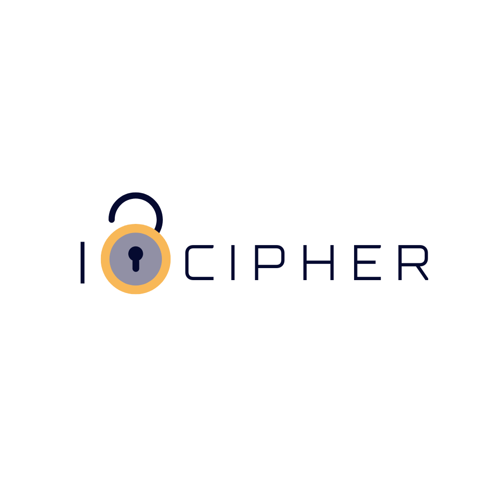

<h1>iCipher <td align="center"></h4></td></h1>

<h3>Introduction</h3>
  
This is an Cipher application. This app runs on IOS. On this app one can insert a sentence or word to encode or decode.

  <h3>Functionalities</h3>
  
This follows rules similar to Caesar's Cipher. Instead of shifting only right side by 3 places one can choose left or right side and also choose how many places to shift.

  <h3>Speciality</h3>
  
This application uses special mathmetical formula that enables the shift number to be more than 26 alphabets or even a negetive integer.

<h3>Requirements</h3>
  <ul>
    <li>Macos and Xcode to build and run</li>
    <li>Virtual IOS device or physical iPhone</li>
    <li>Minimum IOS 13</li> 
  </ul>

<h3>Installation Guide</h3>
  <ol>
    <li>Clone the project using Xcode or macos terminal</li>
    <li>Open the project in xcode</li>
    <li>build and run the project on virtual or physical ios device</li> 
  </ol>

<table style="border:none">
  <tr>  
    <td align="center"></h4></td>
  </tr>
  <tr>  
    <td align="center"><h4>Developed by   Md. Mahinur Rahman</h4></td>
  </tr>
</table>

